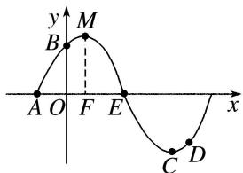

> [!faq]- 教师版对点训练解析
>
> > [!success]- **【答案】** A
>
> > [!note]- **【分析】**
> > 本题未单列分析。
>
> > [!note]- **【解析】**
> > 答案 A 解析 由 E 为该函数图象的一个对称中心，作点 C 的对称点 M，作 $MF \perp x$ 轴，垂足为 F，如图。B 与 D 关于点 E 对称，由 $\overrightarrow{CD}$ 在 x 轴上的投影为 $\frac{\pi}{12}$ ，知 $OF = \frac{\pi}{12}$ ，又 $A\left(-\frac{\pi}{6}, 0\right)$ ，所以 $AF = \frac{T}{4} = \frac{\pi}{2\omega} = \frac{\pi}{4}$ ，所以 $\omega = 2$ 。同时函数 $y = \sin(\omega x + \varphi)$ 图象可以看作是由 $y = \sin \omega x$ 的图象向左平移得到，故可知 $\frac{\varphi}{\omega} = \frac{\varphi}{2} = \frac{\pi}{6}$ ，即 $\varphi = \frac{\pi}{3}$ 。
> > 
