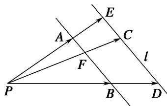

# 专题七 平面向量的等和线

根据平面向量基本定理，如果 $\overrightarrow{PA}$ ， $\overrightarrow{PB}$ 为同一平面内两个不共线的向量，那么这个平面内的任意向量 $\overrightarrow{PC}$ 都可以由 $\overrightarrow{PA}$ ， $\overrightarrow{PB}$ 唯一线性表示： $\overrightarrow{PC} = x\overrightarrow{PA} + y\overrightarrow{PB}$ 。特殊地，如果点 $C$ 正好在直线 $AB$ 上，那么 $x + y = 1$ ，反之如果 $x + y = 1$ ，那么点 $C$ 一定在直线 $AB$ 上。于是有三点共线结论：已知 $\overrightarrow{PA}$ ， $\overrightarrow{PB}$ 为平面内两个不共线的向量，设 $\overrightarrow{PC} = x\overrightarrow{PA} + y\overrightarrow{PB}$ ，则 $A, B, C$ 三点共线的充要条件为 $x + y = 1$ 。

以上讨论了点 $C$ 在直线 $AB$ 上的特殊情况，得到了平面向量中的三点共线结论。下面讨论点 $C$ 不在直线 $AB$ 上的情况。

如图所示，直线 $DE \parallel AB$ ，C 为直线 DE 上任一点，设 $\overrightarrow{PC} = x\overrightarrow{PA} + y\overrightarrow{PB}(x, y \in \mathbf{R})$ .

## 1. 平面向量等和线定义

(1)当直线 DE 经过点 P 时，容易得到 $x + y = 0$ .

(2)当直线 DE 不过点 P 时，直线 PC 与直线 AB 的交点记为 F，因为点 F 在直线 AB 上，所以由三点共线结论可知，若 $\overrightarrow{PF} = \lambda \overrightarrow{PA} + \mu \overrightarrow{PB} (\lambda, \mu \in \mathbf{R})$ ，则 $\lambda + \mu = 1$ 。由 $\triangle PAB$ 与 $\triangle PED$ 相似，知必存在一个常数 $k \in R$ ，使得 $\overrightarrow{PC} = k \overrightarrow{PF}$ （其中 $k = \frac{|PC|}{|PF|} = \frac{|PE|}{|PA|} = \frac{|PD|}{|PB|}$ ），则 $\overrightarrow{PC} = k \overrightarrow{PF} = k \lambda \overrightarrow{PA} + k \mu \overrightarrow{PB}$ 。又 $\overrightarrow{PC} = x \overrightarrow{PA} + y \overrightarrow{PB} (x, y \in \mathbf{R})$ ，所以 $x + y = k \lambda + k \mu = k$ 。以上过程可逆。

在向量起点相同的前提下，所有以与两向量终点所在的直线平行的直线上的点为终点的向量，其基底的系数和为定值，这样的线，我们称之为“等和线”.

## 2. 平面向量等和线定理

平面内一组基底 $\overrightarrow{PA}$ ， $\overrightarrow{PB}$ 及任一向量 $\overrightarrow{PF}$ 满足： $\overrightarrow{PF} = \lambda \overrightarrow{PA} + \mu \overrightarrow{PB} (\lambda, \mu \in \mathbf{R})$ ，若点 $F$ 在直线 $AB$ 上或在平行于 $AB$ 的直线上，则 $\lambda + \mu = k$ （定值），反之也成立，我们把直线 $AB$ 以及与直线 $AB$ 平行的直线称为等和线.

## 3. 平面向量等和线性质

(1)当等和线恰为直线 AB 时，k=1;

(2)当等和线在点 P 和直线 AB 之间时， $k \in (0, 1)$ ;

(3)当直线 AB 在点 P 和等和线之间时， $k \in (1, +\infty)$ ;

(4)当等和线过点 P 时，k=0;

(5)若两等和线关于点 P 对称，则定值 k 互为相反数.

![[高中/总复习/专题/平面向量/专题7 平面向量的等和线-平面向量/考点一_根据等和线求基底系数和的值/考点一_根据等和线求基底系数和的值.md]]
![[高中/总复习/专题/平面向量/专题7 平面向量的等和线-平面向量/考点二_根据等和线求基底的系数和的最值_范围_/考点二_根据等和线求基底的系数和的最值_范围_.md]]
