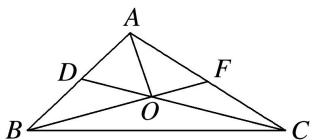

<!-- question-source:start -->
(5)如图所示，在 $\triangle ABC$ 中， $D$ ， $F$ 分别是 $AB$ ， $AC$ 的中点， $BF$ 与 $CD$ 交于点 $O$ ，设 $\overrightarrow{AB}=\boldsymbol{a}$ ， $\overrightarrow{AC}=\boldsymbol{b}$ ，向量 $\overrightarrow{AO}=\lambda\boldsymbol{a}+\mu\boldsymbol{b}$ ，则 $\lambda+\mu$ 的值为\_\_\_\_.

<!-- question-source:end -->

![[高中/总复习/专题/平面向量/专题7 平面向量的等和线-平面向量/考点01_根据等和线求基底系数和的值/例题/answers/Q00045356A1.md]]
