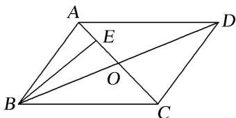

<!-- question-source:start -->
(6)如图，在平行四边形 ABCD 中，AC，BD 相交于点 O，E 为线段 AO 的中点．若 $\overrightarrow{BE} = \lambda \overrightarrow{BA} + \mu \overrightarrow{BD} (\lambda, \mu \in \mathbf{R})$ ，则 $\lambda + \mu$ 等于（）

A. 1 B. $\frac{3}{4}$ C. $\frac{2}{3}$ D. $\frac{1}{2}$
<!-- question-source:end -->

![[高中/总复习/专题/平面向量/专题7 平面向量的等和线-平面向量/考点01_根据等和线求基底系数和的值/例题/answers/Q00045357A1.md]]
