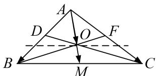

> [!faq]- 《专题7 平面向量的等和线-平面向量》例题解析
>
> > [!success]- **【答案】** 详见解析
>
> > [!note]- **【分析】**
> > 本题未单列分析。
>
> > [!note]- **【解析】**
> > 答案 $\frac{2}{3}$ 解析 等和线法 如图， $BC$ 为值是1的等和线，过 $O$ 作 $BC$ 的平行线，设 $\lambda + \mu = k$ ，则 $k = \frac{|AO|}{|AM|}$ 。由图易知， $\frac{|AO|}{|AM|} = \frac{2}{3}$ 。
> > 
