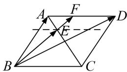

> [!faq]- 《专题7 平面向量的等和线-平面向量》例题解析
>
> > [!success]- **【答案】** B
>
> > [!note]- **【分析】**
> > 本题未单列分析。
>
> > [!note]- **【解析】**
> > 答案 B 解析 通法 ∵为线段 AO 的中点，∴ $\overrightarrow{BE} = \frac{1}{2}\overrightarrow{BA} + \frac{1}{2}\overrightarrow{BO} = \frac{1}{2}\overrightarrow{BA} + \frac{1}{2} \times \frac{1}{2}\overrightarrow{BD} = \frac{1}{2}\overrightarrow{BA} + \frac{1}{4}\overrightarrow{BD} = \lambda\overrightarrow{BA} + \mu\overrightarrow{BD}, \therefore \lambda + \mu = \frac{1}{2} + \frac{1}{4} = \frac{3}{4}.$
> > 等和线法 如图，AD 为值是 1 的等和线，过 E 作 AD 的平行线，设 $\lambda + \mu = k$ ，则 $k = \frac{|BE|}{|BF|}$ 。由图易知， $\frac{|BE|}{|BF|} = \frac{3}{4}$ ，故选 B.
> > 
