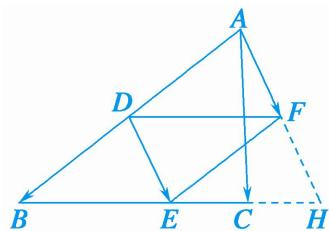

> [!faq]- 《专题7 平面向量的等和线-平面向量》例题解析
>
> > [!success]- **【答案】** 详见解析
>
> > [!note]- **【分析】**
> > 本题未单列分析。
>
> > [!note]- **【解析】**
> > 答案 $\frac{1}{2}$ 解析 如图, 过点 A 作 $\overrightarrow{AF} = \overrightarrow{DE}$ , 设 AF 与 BC 的延长线交于点 H, 易知 AF = FH, $\therefore DF = \frac{1}{2} BH$ , 因此 $\lambda_{1} + \lambda_{2} = \frac{1}{2}$ .
> >
> > 
