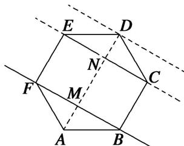

<!-- question-source:start -->
(1)如图，在正六边形 ABCDEF 中，P 是△CDE 内(包括边界)的动点，设 $\overrightarrow{AP} = \alpha \overrightarrow{AB} + \beta \overrightarrow{AF} (\alpha, \beta \in \mathbb{R})$ ，则 $\alpha + \beta$ 的取值范围是 \_\_\_\_.

<!-- question-source:end -->

![[高中/总复习/专题/平面向量/专题7 平面向量的等和线-平面向量/考点02_根据等和线求基底的系数和的最值_范围_/例题/answers/Q00045361A1.md]]
