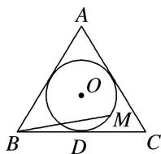

<!-- question-source:start -->
(6)如图, 圆 $O$ 是边长为 $2 \sqrt{3}$ 的等边三角形 $A B C$ 的内切圆, 其与 $B C$ 边相切于点 $D$ , 点 $M$ 为圆上任意一点, $\overrightarrow {B M} = x \overrightarrow {B A} + y \overrightarrow {B D}(x, y \in \mathbf{R})$ , 则 $2x + y$ 的最大值为 ( )

A. $\sqrt{2}$ B. $\sqrt{3}$ C. 2 D. $2\sqrt{2}$
<!-- question-source:end -->

![[高中/总复习/专题/平面向量/专题7 平面向量的等和线-平面向量/考点02_根据等和线求基底的系数和的最值_范围_/例题/answers/Q00045366A1.md]]
