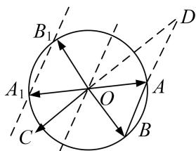

> [!faq]- 《专题7 平面向量的等和线-平面向量》例题解析
>
> > [!success]- **【答案】** 详见解析
>
> > [!note]- **【分析】**
> > 本题未单列分析。
>
> > [!note]- **【解析】**
> > 答案 $(-1,0)$ 解析 通法 由题意得， $\overrightarrow{OC}=k\overrightarrow{OD}(k<0)$ ，又 $|k|=\frac{|\overrightarrow{OC}|}{|\overrightarrow{OD}|}<1,\therefore-1<k<0.$ 又∵B，
> > A, D 三点共线，∴ $\overrightarrow{OD}=\lambda\overrightarrow{OA}+(1-\lambda)\overrightarrow{OB},\quad\therefore m\overrightarrow{OA}+n\overrightarrow{OB}=k\lambda\overrightarrow{OA}+k(1-\lambda)\overrightarrow{OB},\quad\therefore m=k\lambda,\quad n=k(1-\lambda),\quad\therefore m+n=k,$ 从而 $m+n\in(-1,0)$ .
> >
> > 等和线法 如图，作 $\overrightarrow{OA}$ ， $\overrightarrow{OB}$ 的相反向量 $\overrightarrow{OA_1}, \overrightarrow{OB_1}$ ，则 $AB \parallel A_1B_1$ ，过 $O$ 作直线 $l \parallel AB$ ，则直线 $l, A_1B_1$ 分别为以 $\overrightarrow{OA}$ ， $\overrightarrow{OB}$ 为基底的值为 $0, -1$ 的等和线，由题意线段 $CO$ 的延长线与 $BA$ 的延长线交于圆 $O$ 外的一点 $D$ ，所以点 $C$ 在直线 $l$ 与直线 $A_1B_1$ 之间，所以 $m + n \in (-1, 0)$ .
> >
> > 
