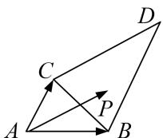

<!-- question-source:start -->
1. 如图, $\triangle BCD$ 与 $\triangle ABC$ 的面积之比为 2, 点 $P$ 是区域 $ABCD$ 内任意一点(含边界), 且 $\overrightarrow{AP} = \lambda \overrightarrow{AB} + \mu \overrightarrow{AC}$ , 则 $\lambda + \mu$ 的取值范围为 ( )

A. $[0, 1]$ B. $[0, 2]$ C. $[0, 3]$ D. $[0, 4]$
<!-- question-source:end -->

![[高中/总复习/专题/平面向量/专题7 平面向量的等和线-平面向量/考点02_根据等和线求基底的系数和的最值_范围_/对点训练/answers/Q00045371A1.md]]
