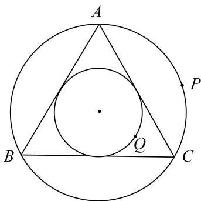

<!-- question-source:start -->
6. 如图, 已知点 $P$ 为等边三角形 $ABC$ 外接圆上一点, 点 $Q$ 是该三角形内切圆上的一点, 若 $\overrightarrow{AP} = x_1\overrightarrow{AB} + y_1\overrightarrow{AC}$ , $\overrightarrow{AQ} = x_2\overrightarrow{AB} + y_2\overrightarrow{AC}$ , 则 $(2x_1 - x_2) + (2y_1 - y_2)$ 的最大值为 \_\_\_\_.

<!-- question-source:end -->

![[高中/总复习/专题/平面向量/专题7 平面向量的等和线-平面向量/考点02_根据等和线求基底的系数和的最值_范围_/对点训练/answers/Q00045376A1.md]]
