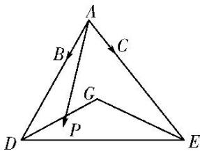

<!-- question-source:start -->
8. 如图, $G$ 为 $\triangle ADE$ 的重心, $P$ 为 $\triangle GDE$ 内任一点(包括边界), $B$ , $C$ 均为 $AD$ , $AE$ 上的三等分点(靠近点 $A$ ), $\overrightarrow{AP} = \alpha \overrightarrow{AB} + \beta \overrightarrow{AC}$ , 则 $\alpha + \frac{1}{2}\beta$ 的取值范围是 \_\_\_\_.

<!-- question-source:end -->

![[高中/总复习/专题/平面向量/专题7 平面向量的等和线-平面向量/考点02_根据等和线求基底的系数和的最值_范围_/对点训练/answers/Q00045378A1.md]]
