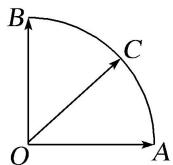

<!-- question-source:start -->
9. 给定两个长度为 1 的平面向量 $\overrightarrow{OA}$ 和 $\overrightarrow{OB}$ ，它们的夹角为 $90^{\circ}$ ，如图所示，点 $C$ 在以 $O$ 为圆心的圆弧 $AB$ 上运动。若 $\overrightarrow{OC} = x\overrightarrow{OA} + y\overrightarrow{OB}$ 。其中 $x, y \in \mathbf{R}$ ，则 $2x + 3y$ 的最大值是（）

A. $\sqrt{13}$ B. 3 C. $\sqrt{5}$ D. 5
<!-- question-source:end -->

![[高中/总复习/专题/平面向量/专题7 平面向量的等和线-平面向量/考点02_根据等和线求基底的系数和的最值_范围_/对点训练/answers/Q00045379A1.md]]
