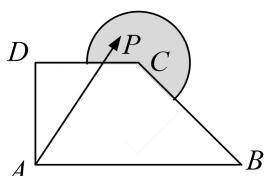

<!-- question-source:start -->
13. 如图，在直角梯形 $ABCD$ 中， $AB \perp AD$ ， $AB // DC$ ， $AB = 2$ ， $AD = DC = 1$ ，图中圆弧所在圆的圆心为点 $C$ ，半径为 $\frac{1}{2}$ ，且点 $P$ 在图中阴影部分（包括边界）运动。若 $\overrightarrow{AP} = x\overrightarrow{AB} + y\overrightarrow{BC}$ ，其中 $x, y \in \mathbf{R}$ ，则 $4x - y$ 的最大值为（ ）

A. $3 - \frac{\sqrt{2}}{4}$ B. $3 + \frac{\sqrt{5}}{2}$ C. 2 D. $3 + \frac{\sqrt{17}}{2}$
<!-- question-source:end -->

![[高中/总复习/专题/平面向量/专题7 平面向量的等和线-平面向量/考点02_根据等和线求基底的系数和的最值_范围_/对点训练/answers/Q00045383A1.md]]
