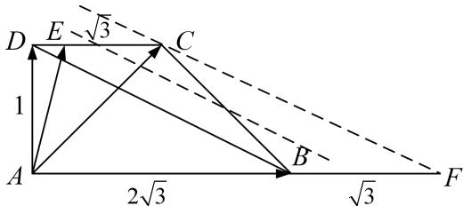

> [!faq]- 《专题7 平面向量的等和线-平面向量》例题解析
>
> > [!success]- **【答案】** 详见解析
>
> > [!note]- **【分析】**
> > 本题未单列分析。
>
> > [!note]- **【解析】**
> > 答案 $\left[0, \frac{1}{2}\right]$ 解析 通法 由题意可求得 $AD = 1$ ， $CD = \sqrt{3}$ ，所以 $\overrightarrow{AB} = 2\overrightarrow{DC}$ 。∵点 $E$ 在线段 $CD$ 上， $\therefore \overrightarrow{DE} = \lambda \overrightarrow{DC} (0 \leq \lambda \leq 1)$ 。∵ $\overrightarrow{AE} = \overrightarrow{AD} + \overrightarrow{DE}$ ，又 $\overrightarrow{AE} = \overrightarrow{AD} + \mu \overrightarrow{AB} = \overrightarrow{AD} + 2\mu \overrightarrow{DC} = \overrightarrow{AD} + \frac{2\mu}{\lambda} \overrightarrow{DE}$ ， $\therefore \frac{2\mu}{\lambda} = 1$ ，即 $\mu = \frac{\lambda}{2}$ 。∵ $0 \leq \lambda \leq 1$ ， $\therefore 0 \leq \mu \leq \frac{1}{2}$ ，即 $\mu$ 的取值范围是 $\left[0, \frac{1}{2}\right]$ 。
> >
> > 等和线法 如图， $(1+\mu)_{\min}=1,\quad\mu_{\min}=0.\quad(1+\mu)_{\max}=\frac{3}{2},\quad\mu_{\max}=\frac{1}{2}.$
> >
> > 
