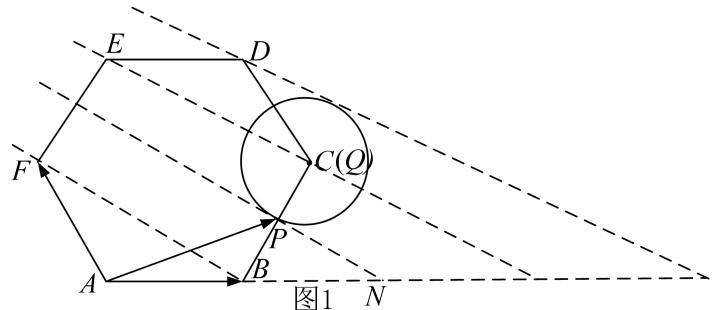
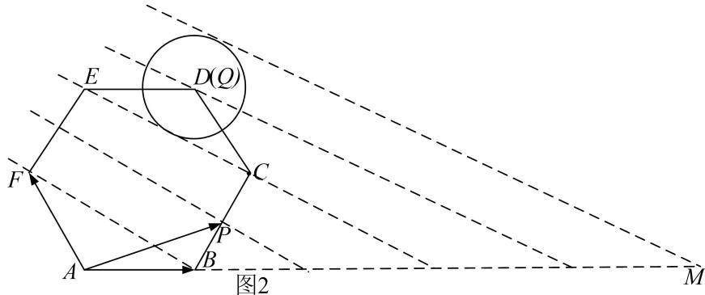

> [!faq]- 《专题7 平面向量的等和线-平面向量》例题解析
>
> > [!success]- **【答案】** 详见解析
>
> > [!note]- **【解析】**
> > 答案 [2, 5] 解析 等和线法 如图1时， $m + n$ 的值最小且 $m + n = \frac{AN}{AB} = 2$ ，如图2时， $m + n$ 的值最大且 $m + n = \frac{AM}{AB} = 5$ ，
> >
> > 
> >
> > 
