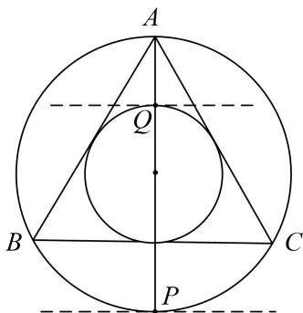

> [!faq]- 《专题7 平面向量的等和线-平面向量》例题解析
>
> > [!success]- **【答案】** 详见解析
>
> > [!note]- **【解析】**
> > 答案 $\frac{7}{3}$ 解析 等和线法 由等和线定理知当点 $P$ ， $Q$ 分别在如图所示的位置时 $x_{1} + y_{1}$ 取最大值， $x_{2} + y_{2}$ 取最小值，且 $x_{1} + y_{1}$ 的最大值为 $\frac{|AP|}{|AM|} = \frac{4}{3}$ ， $x_{2} + y_{2}$ 的最小值为 $\frac{|AQ|}{|AM|} = \frac{1}{3}$ . 故 $|(2x_{1} - x_{2}) + (2y_{1} - y_{2})| = |(2(x_{1} + y_{1}) - (x_{2} + y_{2})| \leq \frac{4}{3} + \frac{1}{3} = \frac{7}{3}$ .
> >
> > 
