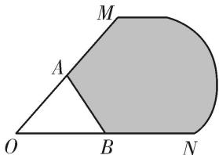

<!-- question-source:start -->
[例 1](1)如图，A, B 分别是射线 OM，ON 上的点，给出下列以 O 为起点的向量：① $\overrightarrow{OA}+2\overrightarrow{OB}$ ; ② $\frac{1}{2}\overrightarrow{OA}+\frac{1}{3}\overrightarrow{OB}$ ; ③ $\frac{3}{4}\overrightarrow{OA}+\frac{1}{3}\overrightarrow{OB}$ ; ④ $\frac{3}{4}\overrightarrow{OA}+\frac{1}{5}\overrightarrow{OB}$ ; ⑤ $\frac{3}{4}\overrightarrow{OA}+\overrightarrow{BA}+\frac{2}{3}\overrightarrow{OB}$ . 其中终点落在阴影区域(不包括边界)内的向量的序号是 \_\_\_\_ (写出满足条件的所有向量的序号).

<!-- question-source:end -->

![[高中/总复习/专题/平面向量/专题7 平面向量的等和线-平面向量/考点一_根据等和线求基底系数和的值/例题选讲/例题/answers/Q00033155A1.md]]
