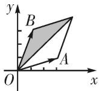
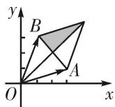
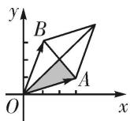
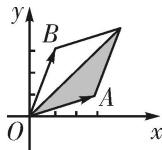

<!-- question-source:start -->
(2)设向量 $\overrightarrow{OA}$ ， $\overrightarrow{OB}$ 不共线(O为坐标原点)，若 $\overrightarrow{OC}=\lambda\overrightarrow{OA}+\mu\overrightarrow{OB}$ ，且 $0\leqslant\lambda\leqslant\mu\leqslant1$ ，则点C所有可能的位置区域用阴影表示正确的是()

A

B

C

D
<!-- question-source:end -->

![[高中/总复习/专题/平面向量/专题7 平面向量的等和线-平面向量/考点一_根据等和线求基底系数和的值/例题选讲/例题/answers/Q00033156A1.md]]
