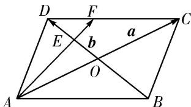

<!-- question-source:start -->
(9)在平行四边形ABCD中，AC与BD相交于点O，点E是线段OD的中点，AE的延长线与CD交于点F，若 $\overrightarrow{AC} = \boldsymbol{a}$ ， $\overrightarrow{BD} = \boldsymbol{b}$ ，且 $\overrightarrow{AF} = \lambda \boldsymbol{a} + \mu \boldsymbol{b}$ ，则 $\lambda + \mu$ 等于（）

A. 1 B. $\frac{3}{4}$ C. $\frac{2}{3}$ D. $\frac{1}{2}$
<!-- question-source:end -->

![[高中/总复习/专题/平面向量/专题7 平面向量的等和线-平面向量/考点一_根据等和线求基底系数和的值/例题选讲/例题/answers/Q00033163A1.md]]
