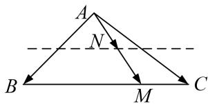

> [!faq]- 教师版例题解析
>
> > [!success]- **【答案】** A
>
> > [!note]- **【分析】**
> > 本题未单列分析。
>
> > [!note]- **【解析】**
> > 答案 A 解析 通法 设 $\overrightarrow{BM} = t\overrightarrow{BC}$ ，则 $\overrightarrow{AN} = \frac{1}{2}\overrightarrow{AM} = \frac{1}{2} (\overrightarrow{AB} +\overrightarrow{BM}) = \frac{1}{2}\overrightarrow{AB} +\frac{1}{2}\overrightarrow{BM} = \frac{1}{2}\overrightarrow{AB} +\frac{t}{2}\overrightarrow{BC} = \frac{1}{2}\overrightarrow{AB}+$ $\frac{t}{2} (\overrightarrow{AC} -\overrightarrow{AB}) = \left(\frac{1}{2} -\frac{t}{2}\right)\overrightarrow{AB} +\frac{t}{2}\overrightarrow{AC},\quad \therefore \lambda = \frac{1}{2} -\frac{t}{2},\mu = \frac{t}{2},\quad \therefore \lambda +\mu = \frac{1}{2},$ 故选A.
> > 等和线法 如图, $BC$ 为值是1的等和线, 过 $N$ 作 $BC$ 的平行线, 设 $\lambda + \mu = k$ , 则 $k = \frac{|AN|}{|AM|}$ . 由图易知, $\frac{|AN|}{|AM|} = \frac{1}{2}$ , 故选A.
> > 
