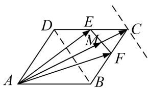

> [!faq]- 教师版例题解析
>
> > [!success]- **【答案】** B
>
> > [!note]- **【分析】**
> > 本题未单列分析。
>
> > [!note]- **【解析】**
> > 答案 $\frac{4}{3}$ 解析 通法 选择 $\overrightarrow{AB},\overrightarrow{AD}$ 作为平面向量的一组基底，则 $\overrightarrow{AC} = \overrightarrow{AB} +\overrightarrow{AD},\overrightarrow{AE} = \frac{1}{2}\overrightarrow{AB} +\overrightarrow{AD},\overrightarrow{AF}$ $= \overrightarrow{AB} +\frac{1}{2}\overrightarrow{AD},$ 又 $\overrightarrow{AC} = \lambda \overrightarrow{AE} +\mu \overrightarrow{AF} = \left(\frac{1}{2}\lambda +\mu\right)\overrightarrow{AB} +\left(\lambda +\frac{1}{2}\mu\right)\overrightarrow{AD},$ 于是得 $\left\{ \begin{array}{l}\frac{1}{2}\lambda +\mu = 1,\\ \lambda +\frac{1}{2}\mu = 1, \end{array} \right.$ 即 $\left\{ \begin{array}{l}\lambda = \frac{2}{3},\\ \mu = \frac{2}{3}, \end{array} \right.$ 故 $\lambda +\mu$ $= \frac{4}{3}.$
> > 等和线法 如图, EF 为值是 1 的等和线, 过 C 作 EF 的平行线, 设 $\lambda + \mu = k$ , 则 $k = \frac{|AC|}{|AM|}$ . 由图易知, $\frac{|AC|}{|AM|} = \frac{4}{3}$ , 故选 B.
> > 
