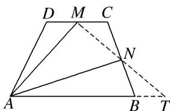
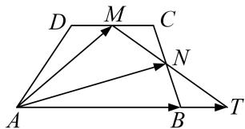

> [!faq]- 教师版例题解析
>
> > [!success]- **【答案】** C
>
> > [!note]- **【分析】**
> > 本题未单列分析。
>
> > [!note]- **【解析】**
> > 答案 C 解析 法一：连接 AC(图略)，由 $\overrightarrow{AB} = \lambda \overrightarrow{AM} + \mu \overrightarrow{AN}$ ，得 $\overrightarrow{AB} = \lambda \cdot \frac{1}{2} (\overrightarrow{AD} + \overrightarrow{AC}) + \mu \cdot \frac{1}{2} (\overrightarrow{AC} + \overrightarrow{AB})$ ，则 $\left(\frac{\mu}{2} - 1\right)_{\overrightarrow{AB}} + \frac{\lambda}{2} \overrightarrow{AD} + \left[\frac{\lambda}{2} + \frac{\mu}{2}\right]_{\overrightarrow{AC}} = 0$ ，得 $\left(\frac{\mu}{2} - 1\right)_{\overrightarrow{AB}} + \frac{\lambda}{2} \overrightarrow{AD} + \left[\frac{\lambda}{2} + \frac{\mu}{2}\right]_{\left[\overrightarrow{AD} + \frac{1}{2} \overrightarrow{AB}\right]} = 0$ ，得 $\left(\frac{1}{4} \lambda + \frac{3}{4} \mu - 1\right)_{\overrightarrow{AB}} + \left(\lambda + \frac{\mu}{2}\right)_{\overrightarrow{AD}} = 0$ 。又 $\overrightarrow{AB}$ ， $\overrightarrow{AD}$ 不共线，所以由平面向量基本定理得 $\left\{\begin{aligned}&\frac{1}{4}\lambda + \frac{3}{4}\mu - 1 = 0,\\&\lambda + \frac{\mu}{2} = 0,\end{aligned}\right.$ 解得 $\left\{\begin{aligned}&\lambda = -\frac{4}{5},\\&\mu = \frac{8}{5}.\\\end{aligned}\right.$ 所以 $\lambda + \mu = \frac{4}{5}.$
> > 法二：因为 $\overrightarrow{AB} = \overrightarrow{AN} + \overrightarrow{NB} = \overrightarrow{AN} + \overrightarrow{CN} = \overrightarrow{AN} + (\overrightarrow{CA} + \overrightarrow{AN}) = 2\overrightarrow{AN} + \overrightarrow{CM} + \overrightarrow{MA} = 2\overrightarrow{AN} - \frac{1}{4}\overrightarrow{AB} - \overrightarrow{AM}$ ，所以 $\overrightarrow{AB} = \frac{8}{5}\overrightarrow{AN} - \frac{4}{5}\overrightarrow{AM}$ ，所以 $\lambda + \mu = \frac{4}{5}$ .
> > 法三：根据题意作出图形如图所示，连接 MN 并延长，交 AB 的延长线于点 T，由已知易得 $AB=\frac{4}{5}AT$ ，所以 $\frac{4}{5}\overrightarrow{AT}=\overrightarrow{AB}=\lambda\overrightarrow{AM}+\mu\overrightarrow{AN}$ ，因为 T, M, N 三点共线，所以 $\lambda+\mu=\frac{4}{5}$ .
> > 
> > 等和线法 如图，连接 $MN$ 并延长，交 $AB$ 的延长线于点 $T$ ，则 $MT$ 为值是1的等和线，设 $\lambda +\mu = k$ ，则 $k = \frac{|AB|}{|AT|}$ .由图易知， $\frac{|AB|}{|AT|} = \frac{4}{5}$ ，故选C.
> > 
