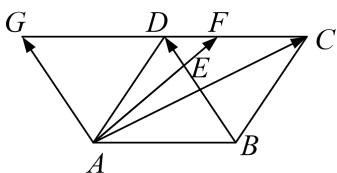

> [!faq]- 教师版例题解析
>
> > [!success]- **【答案】** A
>
> > [!note]- **【分析】**
> > 本题未单列分析。
>
> > [!note]- **【解析】**
> > 答案 A 解析 等和线法 如图，作 $\overrightarrow{AG} = \overrightarrow{BD}$ ，延长 $CD$ 与 $AG$ 相交于 $G$ ，因为 $C, F, G$ 三点共线，所以 $\lambda + \mu = 1$ 。故选 A.
> > 
