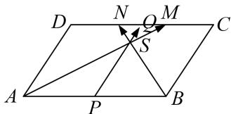

<!-- question-source:start -->
(5)如图，在平行四边形ABCD中，M，N为CD的三等分点，S为AM与BN的交点，P为边AB上一

动点，Q 为三角形 SMN 内一点 (含边界)，若 $\overrightarrow{PQ}=x\overrightarrow{AM}+y\overrightarrow{BN}(x, y\in\mathbf{R})$ ，则 $x+y$ 的取值范围是 \_\_\_\_.

<!-- question-source:end -->

![[高中/总复习/专题/平面向量/专题7 平面向量的等和线-平面向量/考点二_根据等和线求基底的系数和的最值_范围_/例题选讲/例题/answers/Q00033168A1.md]]
