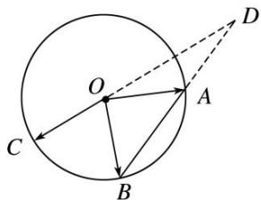

<!-- question-source:start -->
(7) 如图所示, $A$ , $B$ , $C$ 是圆 $O$ 上的三点, 线段 $CO$ 的延长线与 $BA$ 的延长线交于圆 $O$ 外的一点 $D$ , 若 $\overrightarrow{OC} = m\overrightarrow{OA} + n\overrightarrow{OB}$ , 则 $m + n$ 的取值范围是 \_\_\_\_.

<!-- question-source:end -->

![[高中/总复习/专题/平面向量/专题7 平面向量的等和线-平面向量/考点二_根据等和线求基底的系数和的最值_范围_/例题选讲/例题/answers/Q00033170A1.md]]
