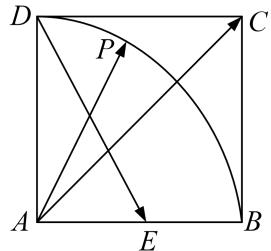

<!-- question-source:start -->
(9)如图，在边长为1的正方形ABCD中，E为AB的中点，P为以A为圆心，AB为半径的圆弧(在正方形内，包括边界点)上的任意一点，若向量 $\overrightarrow{AC}=\lambda\overrightarrow{DE}+\mu\overrightarrow{AP}$ ，则 $\lambda+\mu$ 的最小值为\_\_\_\_.

<!-- question-source:end -->

![[高中/总复习/专题/平面向量/专题7 平面向量的等和线-平面向量/考点二_根据等和线求基底的系数和的最值_范围_/例题选讲/例题/answers/Q00033172A1.md]]
