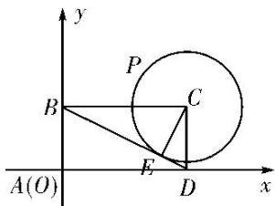

> [!faq]- 教师版例题解析
>
> > [!success]- **【答案】** A
>
> > [!note]- **【分析】**
> > 本题未单列分析。
>
> > [!note]- **【解析】**
> > 答案 A 解析 建立如图所示的直角坐标系，则 C 点坐标为 $(2,1)$ 。设 BD 与圆 C 切于点 E，连接 CE，则 $CE \perp BD$ 。因为 CD = 1，BC = 2，所以 $BD = \sqrt{1^{2} + 2^{2}} = \sqrt{5}$ ， $EC = \frac{BC \cdot CD}{BD} = \frac{2}{\sqrt{5}} = \frac{2\sqrt{5}}{5}$ ，所以 P 点的轨迹方程为 $(x - 2)^{2} + (y - 1)^{2} = \frac{4}{5}$ 。设 $P(x_{0}, y_{0})$ ，则 $\left\{\begin{aligned} x_{0} &= 2 + \frac{2\sqrt{5}}{5}\cos\theta, \\ y_{0} &= 1 + \frac{2\sqrt{5}}{5}\sin\theta \end{aligned}\right.$ （θ为参数），而 $\overrightarrow{AP} = (x_{0}, y_{0})$ ， $\overrightarrow{AB} = (0, 1)$ ， $\overrightarrow{AD} = (2, 0)$ 。因为 $\overrightarrow{AP} = \lambda\overrightarrow{AB} + \mu\overrightarrow{AD} = \lambda(0, 1) + \mu(2, 0) = (2\mu, \lambda)$ ，所以 $\mu = \frac{1}{2}x_{0} = 1 + \frac{\sqrt{5}}{5}\cos\theta$ ， $\lambda = y_{0} = 1 + \frac{2\sqrt{5}}{5}\sin\theta$ 。两式相加，得 $\lambda + \mu = 1 + \frac{2\sqrt{5}}{5}\sin\theta + 1 + \frac{\sqrt{5}}{5}\cos\theta = 2 + \sin(\theta + \varphi) \leq 3$ （其中 $\sin\varphi = \frac{\sqrt{5}}{5}$ ， $\cos\varphi = \frac{2\sqrt{5}}{5}$ ），当且仅当 $\theta = \frac{\pi}{2} + 2k\pi - \varphi$ ， $k \in Z$ 时， $\lambda + \mu$ 取得最大值 3。故选 A。
> > 
> > 等和线法 过动点 $P$ 作等和线，设 $x + y = k$ ，则 $k = \frac{|AM|}{|AB|}$ 。由图易知，当等和线与 $EF$ 重合时， $k$ 取最大值，由 $EF \parallel BD$ ，可求得 $\frac{|AE|}{|AB|} = 3$ ， $\therefore \lambda + \mu$ 取得最大值3。
> >
> > 故选 **A**.
