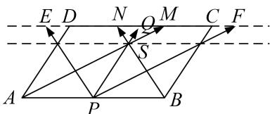

> [!faq]- 教师版例题解析
>
> > [!success]- **【答案】** 详见解析
>
> > [!note]- **【分析】**
> > 本题未单列分析。
>
> > [!note]- **【解析】**
> > 答案 $\left[\frac{3}{4}, 1\right]$ 解析 如图，作 $\overrightarrow{PE} = \overrightarrow{BN}$ ， $\overrightarrow{PF} = \overrightarrow{AM}$ ，过 $S$ 直线 $MN$ 的平行线，由等和线定理知， $(x + y)_{max} = 1$ ， $(x + y)_{min} = \frac{3}{4}$ .
> > 
