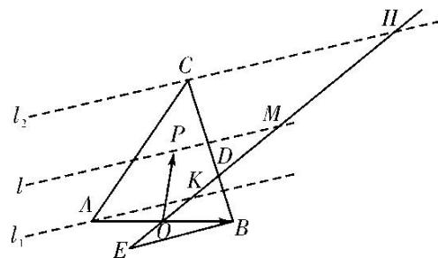

> [!faq]- 教师版例题解析
>
> > [!success]- **【答案】** 详见解析
>
> > [!note]- **【分析】**
> > 本题未单列分析。
>
> > [!note]- **【解析】**
> > 答案 $[-8, -1]$ 解析 等和线法 如图，延长 $DO$ 至点 $E$ ，使 $DO = 2OE$ ，则 $\overrightarrow{OE} = -\frac{1}{2}\overrightarrow{OD}$ ，则 $\overrightarrow{OP} = x\overrightarrow{OB} + y\overrightarrow{OD} = x\overrightarrow{OB} + (-2y)\overrightarrow{OE}$ ，令 $z = -2y$ ，则 $x - 2y = x + z$ ， $\overrightarrow{OP} = x\overrightarrow{OB} + z\overrightarrow{OE}$ ，设过点 $A,C,P$ 与 $BE$ 平行的直线分别为为 $l_{1},l_{2},l,$ 设 $l,l_2$ 交线段 $OD$ 延长线于点 $M,H,l_1$ 交线段 $OD$ 于点 $K,$ 令 $x + z = t$ ，由图形知， $t = -\frac{OM}{OE}$ ，“等和线” $l$ 可从 $l_{1}$ 的位置平移至 $l_{2}$ 的位置，由平面几何知识可知△OBE≌△OAK，△DBE∽△DCH，所以 $\frac{OE}{OK} = \frac{OB}{OA} = 1$ ， $\frac{BD}{CD} = \frac{DE}{DH} = \frac{3OE}{DH} = \frac{1}{2}$ ，所以 $1 = \frac{OK\leq OM\leq OH}{OE\leq OE\leq OE} = \frac{OD + DH}{OE} = \frac{2OE + 6OE}{OE} = 8$ ，则 $-8\leq t\leq -1$ ，故 $x - 2y$ 的取值范围为[-8，-1].
> > 
