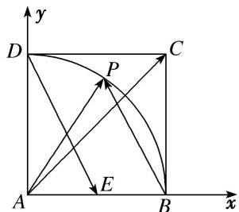
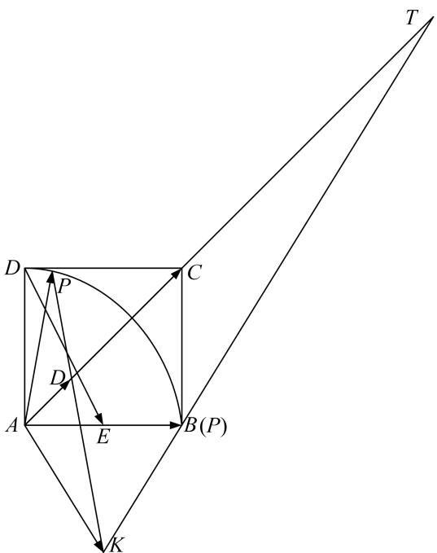

> [!faq]- 教师版例题解析
>
> > [!success]- **【答案】** 详见解析
>
> > [!note]- **【分析】**
> > 本题未单列分析。
>
> > [!note]- **【解析】**
> > 答案 $\frac{1}{2}$ 解析 通法 以 $A$ 为原点，以 $AB$ 所在的直线为 $x$ 轴， $AD$ 所在的直线为 $y$ 轴建立如图所示的平面直角坐标系，则 $A(0,0), B(1,0), E\left(\frac{1}{2},0\right), C(1,1), D(0,1)$ 。设 $P(\cos \theta, \sin \theta), \therefore \overrightarrow{AC} = (1,1), \overrightarrow{AP} = (\cos \theta, \sin \theta), \overrightarrow{DE} = \left(\frac{1}{2}, -1\right), \because \overrightarrow{AC} = \lambda \left(\frac{1}{2}, -1\right) + \mu (\cos \theta, \sin \theta) = \left(\frac{\lambda}{2} + \mu \cos \theta, -\lambda + \mu \sin \theta\right) = (1,1)$ ，
> > 
> > $\therefore \left\{ \begin{array}{l} \frac{\lambda}{2} + \mu \cos \theta = 1, \\ -\lambda + \mu \sin \theta = 1, \end{array} \right.$ $\therefore \left\{ \begin{array}{l} \lambda = \frac{2 \sin \theta - 2 \cos \theta}{2 \cos \theta + \sin \theta}, \\ \mu = \frac{3}{2 \cos \theta + \sin \theta}, \end{array} \right.$ $\therefore \lambda + \mu = \frac{3 + 2 \sin \theta - 2 \cos \theta}{2 \cos \theta + \sin \theta} = -1 + \frac{3 \sin \theta + 3}{2 \cos \theta + \sin \theta}.$
> > $\therefore (\lambda + \mu)' = \frac{6 + 6\sin\theta - 3\cos\theta}{(2\cos\theta + \sin\theta)^2} > 0$ ，故 $\lambda + \mu$ 在 $\left[0, \frac{\pi}{2}\right]$ 上是增函数， $\therefore$ 当 $\theta = 0$ ，即 $\cos\theta = 1$ 时， $\lambda + \mu$ 取最小值为 $\frac{3 + 0 - 2}{2 + 0} = \frac{1}{2}$ .
> > 等和线法 由题意, 作 $\overrightarrow{AK} = \overrightarrow{DE}$ , 设 $\overrightarrow{AD} = \lambda \overrightarrow{AC}$ , 直线 $AC$ 与 $PK$ 直线相交于点 $D$ , 则有 $\overrightarrow{AD} = \lambda x \overrightarrow{AK} + \lambda y \overrightarrow{AP}$ , 由等和线定理, $\lambda x + \lambda y = 1$ , 从而 $x + y = \frac{1}{\lambda}$ , 当点 $P$ 与 $B$ 点重合时, 如图, $\lambda_{max} = 2$ , 此时, $(x + y)_{max} = \frac{1}{2}$ .
> > 
