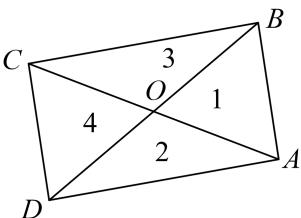

> [!faq]- 教师版例题解析
>
> > [!success]- **【答案】** D
>
> > [!note]- **【分析】**
> > 本题未单列分析。
>
> > [!note]- **【解析】**
> > 答案 D 解析 等和线法 如图，分别作 $\overrightarrow{OC} = -\overrightarrow{OA}$ ， $\overrightarrow{OD} = -\overrightarrow{OB}$ 。当 $\lambda \geq 0$ ， $\mu \geq 0$ 时， $\{P|\overrightarrow{OP} = \lambda \overrightarrow{OA} + \mu \overrightarrow{OB}, |\lambda| + |\mu| \leq 1, \lambda, \mu \in \mathbf{R}\} = \{P|\overrightarrow{OP} = |\lambda|\overrightarrow{OA} + |\mu|\overrightarrow{OB}, |\lambda| + |\mu| \leq 1, \lambda, \mu \in \mathbf{R}\}$ ，对应区域 1；当 $\lambda \geq 0$ ， $\mu < 0$ 时， $\{P|\overrightarrow{OP} = \lambda \overrightarrow{OA} + \mu \overrightarrow{OB}, |\lambda| + |\mu| \leq 1, \lambda, \mu \in \mathbf{R}\} = \{P|\overrightarrow{OP} = |\lambda|\overrightarrow{OA} + |\mu|\overrightarrow{OD}, |\lambda| + |\mu| \leq 1, \lambda, \mu \in \mathbf{R}\}$ ，对应区域 2；
> > 
> > 当 $\lambda < 0$ ， $\mu \geq 0$ 时， $\{P|\overrightarrow{OP} = \lambda \overrightarrow{OA} +\mu \overrightarrow{OB}, |\lambda | + |\mu |\leq 1,\lambda ,\mu \in \mathbf{R}\} = \{P|\overrightarrow{OP} = |\lambda |\overrightarrow{OC} +|\mu |\overrightarrow{OB}, |\lambda | + |\mu |\leq 1,\lambda ,\mu$ $\in \mathbf{R}\}$ ，对应区域3；当 $\lambda < 0$ ， $\mu < 0$ 时， $\{P|\overrightarrow{OP} = \lambda \overrightarrow{OA} +\mu \overrightarrow{OB}, |\lambda | + |\mu |\leq 1,\lambda ,\mu \in \mathbf{R}\} = \{P|\overrightarrow{OP} = |\lambda |\overrightarrow{OC} +|\mu |\overrightarrow{OD}, |\lambda |+\mid \mu |\leq 1,\lambda ,\mu \in \mathbf{R}\}$ ，对应区域4．综上所述可得，点集 $\{P|\overrightarrow{OP} = \lambda \overrightarrow{OA} +\mu \overrightarrow{OB}, |\lambda | + |\mu |\leq 1,\lambda ,\mu \in \mathbf{R}\}$ 所表示的区域即图中的矩形区域，其面积 $S = 2\times 2\sqrt{3} = 4\sqrt{3}$
> >
> > 故选 **D**.
