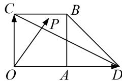

<!-- question-source:start -->
3. 如图, 四边形 $OABC$ 是边长为 1 的正方形, 点 $D$ 在 $OA$ 的延长线上, 且 $OD = 2$ , 点 $P$ 是 $\triangle BCD$ 内任意一点 (含边界), 设 $\overrightarrow{OP} = \lambda \overrightarrow{OC} + \mu \overrightarrow{OD}$ , 则 $\lambda + \mu$ 的取值范围为 \_\_\_\_.

3.
<!-- question-source:end -->

![[高中/总复习/专题/平面向量/专题7 平面向量的等和线-平面向量/考点二_根据等和线求基底的系数和的最值_范围_/对点训练/题目/answers/Q00033176A1.md]]
