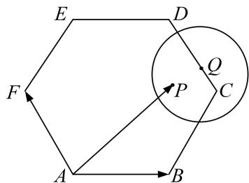

<!-- question-source:start -->
5. 如图, 在边长为 2 的正六边形 $ABCDEF$ 中, 动圆 $Q$ 半径为 1 , 圆心在线段 $CD$ (含端点)上运动, $P$ 是圆上及其内部的动点, 设 $\overrightarrow{AP} = m\overrightarrow{AB} + n\overrightarrow{AF}(m, n \in \mathbf{R})$ , 则 $m + n$ 的取值范围是 \_\_\_\_.

5.
<!-- question-source:end -->

![[高中/总复习/专题/平面向量/专题7 平面向量的等和线-平面向量/考点二_根据等和线求基底的系数和的最值_范围_/对点训练/题目/answers/Q00033178A1.md]]
