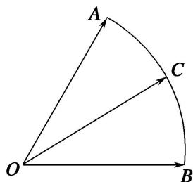

<!-- question-source:start -->
7. 如图，在扇形 $OAB$ 中， $\angle AOB = \frac{\pi}{3}$ ， $C$ 为弧 $AB$ 上的动点，若 $\overrightarrow{OC} = x\overrightarrow{OA} + y\overrightarrow{OB}$ ，则 $x + 3y$ 的取值范围是 \_\_\_\_.

7.
<!-- question-source:end -->

![[高中/总复习/专题/平面向量/专题7 平面向量的等和线-平面向量/考点二_根据等和线求基底的系数和的最值_范围_/对点训练/题目/answers/Q00033180A1.md]]
