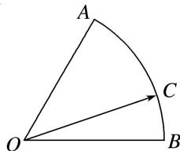

<!-- question-source:start -->
12. 如图，在扇形 $OAB$ 中， $\angle AOB = \frac{\pi}{3}$ ， $C$ 为弧 $\widehat{AB}$ 上的一个动点，若 $\overrightarrow{OC} = x\overrightarrow{OA} + y\overrightarrow{OB}$ ，则 $x - y$ 的取值

范围是\_\_\_\_。

12.
<!-- question-source:end -->

![[高中/总复习/专题/平面向量/专题7 平面向量的等和线-平面向量/考点二_根据等和线求基底的系数和的最值_范围_/对点训练/题目/answers/Q00033185A1.md]]
