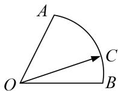

<!-- question-source:start -->
14. 如图，在扇形 $OAB$ 中， $\angle AOB = \frac{\pi}{3}$ ， $C$ 为弧 $AB$ 上，且与 $A, B$ 不重合的一个动点， $\overrightarrow{OC} = x\overrightarrow{OA} + y\overrightarrow{OB}$ ，若 $u = x + \lambda y (\lambda > 0)$ 存在最大值，则 $\lambda$ 的取值范围为（）

A. $(\frac{1}{2}, 1)$ B. (1, 3) C. $(\frac{1}{2}, 2)$ D. $(\frac{1}{3}, 3)$

14.
<!-- question-source:end -->

![[高中/总复习/专题/平面向量/专题7 平面向量的等和线-平面向量/考点二_根据等和线求基底的系数和的最值_范围_/对点训练/题目/answers/Q00033187A1.md]]
