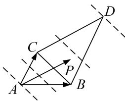

> [!faq]- 教师版对点训练解析
>
> > [!success]- **【答案】** C
>
> > [!note]- **【分析】**
> > 本题未单列分析。
>
> > [!note]- **【解析】**
> > 答案 解析 等和线法 如图， $(\lambda + \mu)_{\min} = 0$ ， $(\lambda + \mu)_{\max} = 3$ 。故选 C.
> > 
