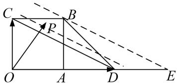

> [!faq]- 教师版对点训练解析
>
> > [!success]- **【答案】** 详见解析
>
> > [!note]- **【分析】**
> > 本题未单列分析。
>
> > [!note]- **【解析】**
> > 答案 $\left[1, \frac{3}{2}\right]$ 解析 等和线法 如图， $(\lambda + \mu)_{\min} = 1$ ， $(\lambda + \mu)_{\max} = \frac{3}{2}$ .
> > 
