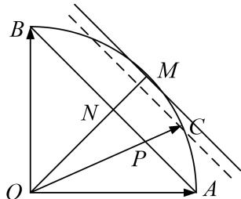

> [!faq]- 教师版对点训练解析
>
> > [!success]- **【答案】** B
>
> > [!note]- **【分析】**
> > 本题未单列分析。
>
> > [!note]- **【解析】**
> > 答案 B 解析 通法 因为点 C 在以 O 为圆心的圆弧 $\widehat{AB}$ 上，所以 $|\overrightarrow{OC}|^{2}=|x\overrightarrow{OA}+y\overrightarrow{OB}|^{2}=x^{2}+y^{2}+2xy\overrightarrow{OA}\cdot\overrightarrow{OB}=x^{2}+y^{2},\therefore x^{2}+y^{2}=1$ ，则 $2xy\leq x^{2}+y^{2}=1$ 。又 $(x+y)^{2}=x^{2}+y^{2}+2xy\leq2$ ，故 $x+y$ 的最大值为 $\sqrt{2}$ .
> > 等和线法 确定值为 1 的等和线 AB，过动点 C 作等和线，设 $x + y = k$ ，则 $k = \frac{|CO|}{|PO|}$ 。由图易知，当等和线与圆相切时，k 取最大值，此时 $\frac{|MO|}{|NO|} = \sqrt{2}$ ，∴ $x + y$ 取得最大值 $\sqrt{2}$ 。故选 B.
> > 
