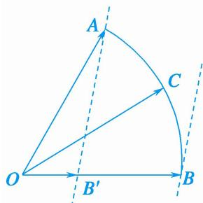

> [!faq]- 教师版对点训练解析
>
> > [!success]- **【答案】** 详见解析
>
> > [!note]- **【分析】**
> > 本题未单列分析。
>
> > [!note]- **【解析】**
> > 答案 [1, 3] 解析 等和线法 依题意， $\overrightarrow{OC} = x\overrightarrow{OA} + 3y\left(\frac{\overrightarrow{OB}}{3}\right)$ ，如图，作 $\overrightarrow{OB'} = \frac{\overrightarrow{OB}}{3}$ ，重新调整基底为 $\overrightarrow{OA}$ ， $\overrightarrow{OB'}$ ，设 $k = x + 3y$ ，显然，当 $C$ 在 $A$ 点时，经过 $k = 1$ 的等和线，当 $C$ 在 $B$ 点时，经过 $k = 3$ 的等和线，这两条线分别是最近与最远的等和线，所以 $x + 3y$ 的取值范围是[1, 3].
> > 
