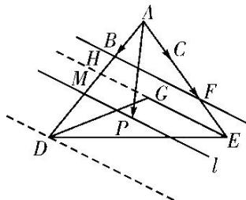

> [!faq]- 教师版对点训练解析
>
> > [!success]- **【答案】** 详见解析
>
> > [!note]- **【分析】**
> > 本题未单列分析。
>
> > [!note]- **【解析】**
> > 答案 $\left[\frac{3}{2}, 3\right]$ 解析 等和线法 如图, 在线段 $AE$ 上取点 $F$ , 使 $AC = CF$ , 则 $\overrightarrow{AP} = \alpha \overrightarrow{AB} + \frac{1}{2} \beta \overrightarrow{AF}$ , 设 $\frac{1}{2} \beta = \gamma$ , 则 $\overrightarrow{AP} = \alpha \overrightarrow{AB} + \gamma \overrightarrow{AF}$ , 连接 $BF$ , 延长 $EG$ 交 $AD$ 于点 $H$ , 因为 $G$ 为 $\triangle ADE$ 的重心, 所以 $H$ 为 $AD$ 的中点, 又 $B$ , $C$ 均为 $AD$ , $AE$ 上靠近点 $A$ 的三等分点, 所以 $\frac{AF}{FE} = \frac{AB}{BH} = 2$ , 所以 $BF // HE$ , 过点 $P$ 作直线 $l // HE$ 交 $AD$ 于点 $M$ ,
> > 
> > 设 $\alpha+\gamma=t$ ，则 $t=\frac{AM}{AB}$ ，由图形知，“等值线”l可从直线HE的位置平移到过点D的位置，由平面几何知识可知 $\frac{3}{2}=\frac{AH}{AB}\leqslant\frac{AM}{AB}\leqslant\frac{AD}{AB}=3$ ，故 $\frac{3}{2}\leqslant t\leqslant3$ ，即 $\alpha+\gamma\in\left[\frac{3}{2},3\right]$ ，故 $\alpha+\frac{1}{2}\beta$ 的取值范围是 $\left[\frac{3}{2},3\right]$ .
