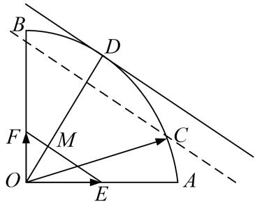

> [!faq]- 教师版对点训练解析
>
> > [!success]- **【答案】** A
>
> > [!note]- **【分析】**
> > 本题未单列分析。
>
> > [!note]- **【解析】**
> > 答案 A 解析 通法 ∵点 C 在以 O 为圆心的圆弧 AB 上运动，∴可以设圆的参数方程 $x = \cos \theta$
> > $y=\sin\theta,\quad\theta\in[0^{\circ},\quad90^{\circ}],\quad\therefore2x+3y=2\cos\theta+3\sin\theta=\sqrt{13}\sin(\theta+\varphi)$ ，其中 $\cos\varphi=\frac{3}{\sqrt{13}}$ ， $\sin\varphi=\frac{2}{\sqrt{13}}$ ， $\therefore 3x + 5y \leqslant \sqrt{13}$ ，当且仅当 $\sin(\theta + \varphi) = 1$ 时取等号. $\therefore x + y$ 的最大值是 $\sqrt{13}$ ，当三角函数取到1时成立.故选A.
> > 等和线法 $\overrightarrow{OC}=x\overrightarrow{OA}+y\overrightarrow{OB}=2x(\frac{1}{2}\overrightarrow{OA})+3y(\frac{1}{3}\overrightarrow{OB})=2x\overrightarrow{OE}+3y\overrightarrow{OF},\quad2x+3y=k,$ 则 $k=\frac{|OD|}{|OM|}=\sqrt{13}.$
> > 
