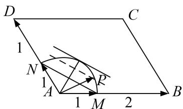

> [!faq]- 教师版对点训练解析
>
> > [!success]- **【答案】** 详见解析
>
> > [!note]- **【分析】**
> > 本题未单列分析。
>
> > [!note]- **【解析】**
> > 答案 2 解析 通法 $|\overrightarrow{AP}|^2 = (x\overrightarrow{AB} + y\overrightarrow{AD})^2 = 9x^2 + 4y^2 + 2xy \times 3 \times 2 \times \left(-\frac{1}{2}\right) = (3x + 2y)^2 - 3(3x) \cdot (2y) \geq (3x + 2y)^2 - \frac{3}{4}(3x + 2y)^2 = \frac{1}{4}(3x + 2y)^2$ 。又 $|\overrightarrow{AP}|^2 = 1$ ，因此 $\frac{1}{4}(3x + 2y)^2 \leq 1$ ，故 $3x + 2y \leq 2$ ，当且仅当 $3x = 2y$ ，即 $x = \frac{1}{3}$ ， $y = \frac{1}{2}$ 时， $3x + 2y$ 取得最大值 2。
> > 等和线法 可转化为例 2(2).
> > 
