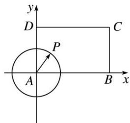
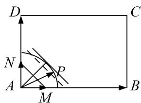

> [!faq]- 教师版对点训练解析
>
> > [!success]- **【答案】** 详见解析
>
> > [!note]- **【分析】**
> > 本题未单列分析。
>
> > [!note]- **【解析】**
> > 答案 $\frac{\sqrt{10}}{2}$ 解析 通法 建立如图所示的平面直角坐标系，设 $P(x, y), B(\sqrt{5}, 0), C(\sqrt{5}, \sqrt{3}), D(0, \sqrt{3})$ . $\because AP = \frac{\sqrt{5}}{2}, \therefore x^2 + y^2 = \frac{5}{4}$ . 点 $P$ 满足的约束条件为 $\left\{ \begin{array}{l} 0 \leq x \leq \sqrt{5}, \\ 0 \leq y \leq \sqrt{3}, \\ x^2 + y^2 = \frac{5}{4}, \end{array} \right.$ $\because \overrightarrow{AP} = \lambda \overrightarrow{AB} + \mu \overrightarrow{AD} (\lambda, \mu \in \mathbf{R})$ , $\therefore (x, y) = \lambda (\sqrt{5}, 0) + \mu (0, \sqrt{3}), \therefore \left\{ \begin{array}{l} x = \sqrt{5} \lambda, \\ y = \sqrt{3} \mu, \end{array} \right.$ $\therefore x + y = \sqrt{5} \lambda + \sqrt{3} \mu$ . $\because x + y \leq \sqrt{2(x^2 + y^2)} = \sqrt{2 \times \frac{5}{4}} = \frac{\sqrt{10}}{2}$ , 当且仅当 $x = y$ 时取等号， $\therefore \sqrt{5} \lambda + \sqrt{3} \mu$ 的最大值为 $\frac{\sqrt{10}}{2}$ .
> > 
> > 等和线法 $\overrightarrow{AP} = \lambda \overrightarrow{AB} +\mu \overrightarrow{AD} = \sqrt{5}\lambda (\frac{1}{\sqrt{5}}\overrightarrow{AB}) + \sqrt{3}\mu (\frac{1}{\sqrt{3}}\overrightarrow{AD}) = \sqrt{5}\lambda \overrightarrow{AM} +\sqrt{3}\mu \overrightarrow{AN},\sqrt{5}\lambda +\sqrt{3}\mu = k$ ，则 $k = \frac{\frac{\sqrt{5}}{2}}{\frac{\sqrt{2}}{2}}$ $= \frac{\sqrt{10}}{2}.$
> > 
