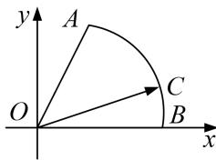
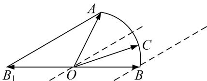

> [!faq]- 教师版对点训练解析
>
> > [!success]- **【答案】** 详见解析
>
> > [!note]- **【分析】**
> > 本题未单列分析。
>
> > [!note]- **【解析】**
> > 答案 $[-1, 1]$ 解析 通法 设半径为 1，由已知可设 $OB$ 为 $x$ 轴的正半轴， $O$ 为坐标原点，建立直角坐标系，其中 $A\left(\frac{1}{2}, \frac{\sqrt{3}}{2}\right)$ ； $B(1,0)$ ； $C(\cos \theta, \sin \theta)$ （其中 $\angle BOC = \theta (0 \leqslant \theta \leqslant \frac{\pi}{3})$ ，有若 $\overrightarrow{OC} = x\overrightarrow{OA} + y\overrightarrow{OB} = (\cos \theta, \sin \theta) = x\left(\frac{1}{2}, \frac{\sqrt{3}}{2}\right) + y(1, 0)$ ；整理得： $\frac{1}{2}x + y = \cos \theta$ ； $\frac{\sqrt{3}}{2}x = \sin \theta$ ，解得 $x = \frac{2\sin \theta}{\sqrt{3}}$ ， $y = \cos \theta - \frac{\sin \theta}{\sqrt{3}}$ ，则 $x - y = \frac{2\sin \theta}{\sqrt{3}} - \cos \theta + \frac{\sin \theta}{\sqrt{3}} = \sqrt{3}\sin \theta - \cos \theta = 2\sin (\theta - \frac{\pi}{6})$ ，其中 $(0 \leqslant \theta \leqslant \frac{\pi}{3})$ ；易知 $x - y = \frac{2\sin \theta}{\sqrt{3}} - \cos \theta + \frac{\sin \theta}{\sqrt{3}} = \sqrt{3}\sin \theta - \cos \theta = 2\sin (\theta - \frac{\pi}{6})$ ，为增函数，由单调性易得其值域为 $[-1, 1]$ ，故答案为 $[-1, 1]$ .
> > 
> > 等和线法
> > 
