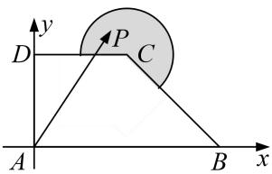

> [!faq]- 教师版对点训练解析
>
> > [!success]- **【答案】** B
>
> > [!note]- **【分析】**
> > 本题未单列分析。
>
> > [!note]- **【解析】**
> > 答案 B 解析 以 A 为坐标原点，AB 为 x 轴，AD 为 y 轴建立平面直角坐标系，则 $A(0,0)$ ， $D(0,1)$ ， $C(1,1)$ ， $B(2,0)$ ，直线 BD 的方程为 $x + 2y - 2 = 0$ ，C 到 BD 的距离 $d = \frac{\sqrt{5}}{5}$ ，∴ 圆弧以点 C 为圆心的圆方程为 $(x - 1)^{2} + (y - 1)^{2} = \frac{1}{4}$ ，设 $P(m,n)$ 则 $\overrightarrow{AP} = (m,n)$ ， $\overrightarrow{AD} = (0,1)$ ， $\overrightarrow{AB} = (2,0)$ ， $\overrightarrow{BC} = (-1,1)$ ，若 $\overrightarrow{AP} = x\overrightarrow{AB} + y\overrightarrow{BC}$ ，∴ $(m, n) = (2x - y, y)$ ，∴ m = 2x - y，n = y，∵ P 在圆内或圆上，∴ $(2x - y - 1)^{2} + (y - 1)^{2} \leqslant \frac{1}{4}$ ，设 4x - y = t，则 y = 4x - t，代入上式整理得 $80x^{2} - (48t + 16)x + 8t^{2} + 7 \leqslant 0$ ，设 $f(x) = 80x^{2} - (48t + 16)x + 8t^{2} + 7\leqslant 0$ ， $x\in [\frac{1}{2},\frac{3}{2} ]$ ，则 $\left\{ \begin{array}{l}f(\frac{1}{2}) <   0\\ f(\frac{3}{2}) <   0 \end{array} \right.$ ，解得 $2\leqslant t\leqslant 3 + \frac{\sqrt{5}}{2}$ ，故 $4x - y$ 的最大值为 $3 + \frac{\sqrt{5}}{2}$ ，故选B.
> > 
> > 等和线法
