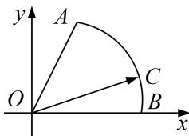

> [!faq]- 教师版对点训练解析
>
> > [!success]- **【答案】** C
>
> > [!note]- **【分析】**
> > 本题未单列分析。
>
> > [!note]- **【解析】**
> > 答案 C 解析 通法 以 O 为原点，OB 为 x 轴，建立如图所示的直角坐标系，设 $\angle COB = \theta (0 < \theta < \frac{\pi}{3})$ OB = 1，则 $C(\cos\theta, \sin\theta)$ ， $B(1,0)$ ， $A(\frac{1}{2}, \frac{\sqrt{3}}{2})$ ，由 $\overrightarrow{OC} = x\overrightarrow{OA} + y\overrightarrow{OB}$ ，得 $\left\{\begin{aligned}\cos\theta &= y + \frac{1}{2}x \\ \sin\theta &= \frac{\sqrt{3}}{2}x\end{aligned}\right.$ ， $\therefore \left\{\begin{aligned}x &= \frac{2}{\sqrt{3}}\sin\theta \\ y &= \cos\theta - \frac{\sin\theta}{\sqrt{3}}\end{aligned}\right.$ ， $\therefore u = x + \lambda y = \frac{2 - \lambda}{\sqrt{3}}\sin\theta + \lambda\cos\theta (0 < \theta < \frac{\pi}{3})$ ， $\because u = x + \lambda y (\lambda > 0)$ 存在最大值， $\therefore u(\theta)$ 存在极值点， $\therefore u' = \frac{2 - \lambda}{\sqrt{3}}\cos\theta - \lambda\sin\theta$ 在 $\theta \in (0, \frac{\pi}{3})$ 上有零点．令 $u' = 0$ ，则 $\tan\theta = \frac{2 - \lambda}{\sqrt{3}\lambda}$ ， $\because \theta \in (0, \frac{\pi}{3})$ ， $\therefore \tan\theta = \frac{2 - \lambda}{\sqrt{3}\lambda} \in (0, \sqrt{3})$ ， $\therefore \frac{1}{2} < \lambda < 2$ ， $\therefore \lambda$ 的取值范围为 $(\frac{1}{2}, 2)$ 。故选 C.
> > 
> > 等和线法
