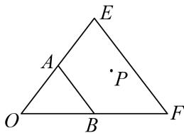
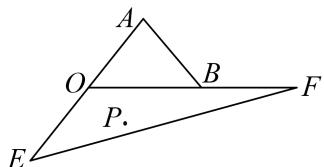

> [!faq]- 教师版对点训练解析
>
> > [!success]- **【答案】** D
>
> > [!note]- **【分析】**
> > 本题未单列分析。
>
> > [!note]- **【解析】**
> > 答案 D 解析 $\because \overrightarrow{OA} \cdot \overrightarrow{OB} = \sqrt{2} \times \sqrt{2} \times \cos \angle AOB = 1, \therefore \cos \angle AOB = \frac{1}{2}$ , 即 $\angle AOB = 60^{\circ}$ . (1) 若 $\lambda > 0$ , $\mu > 0$ , 设 $\overrightarrow{OE} = 2\overrightarrow{OA}$ , $\overrightarrow{OF} = 2\overrightarrow{OB}$ , 则 $\overrightarrow{OP} = \frac{\lambda}{2}\overrightarrow{OE} + \frac{\mu}{2}\overrightarrow{OF}$ ,
> > 
> > $\because |\lambda| + |\mu| = \lambda + \mu \leqslant 2$ ，故当 $\lambda + \mu = 2$ 时， $E$ ， $F$ ， $P$ 三点共线，故点 $P$ 表示的区域为 $\Delta OEF$ ，此时 $S_{\Delta OEF} = \frac{1}{2} \times 2\sqrt{2} \times 2\sqrt{2} \times \sin 60^\circ = 2\sqrt{3}$ .
> > (2)若 $\lambda < 0$ ， $\mu > 0$ ，设 $\overrightarrow{OE} = -2\overrightarrow{OA}$ ， $\overrightarrow{OF} = 2\overrightarrow{OB}$ ，则 $\overrightarrow{OP} = -\frac{\lambda}{2}\overrightarrow{OE} + \frac{\mu}{2}\overrightarrow{OF}$
> > 
> > $\because |\lambda| + |\mu| = -\lambda + \mu \leqslant 2$ ，故当 $-\lambda + \mu = 2$ 时， $P$ ， $E$ ， $F$ 三点共线，故点 $P$ 表示的区域为 $\Delta OEF$ ，此时 $S_{\Delta OEF} = \frac{1}{2} \times 2\sqrt{2} \times 2\sqrt{2} \times \sin 120^\circ = 2\sqrt{3}$ 。同理可得：当 $\lambda > 0$ ， $\mu < 0$ 时， $P$ 点表示的区域面积为 $2\sqrt{3}$ ，当 $\lambda < 0$ ， $\mu < 0$ 时， $P$ 点表示的区域面积为 $2\sqrt{3}$ ，综上， $P$ 点表示的区域面积为 $2\sqrt{3} \times 4 = 8\sqrt{3}$ 。故选 D.
> > 等和线法
